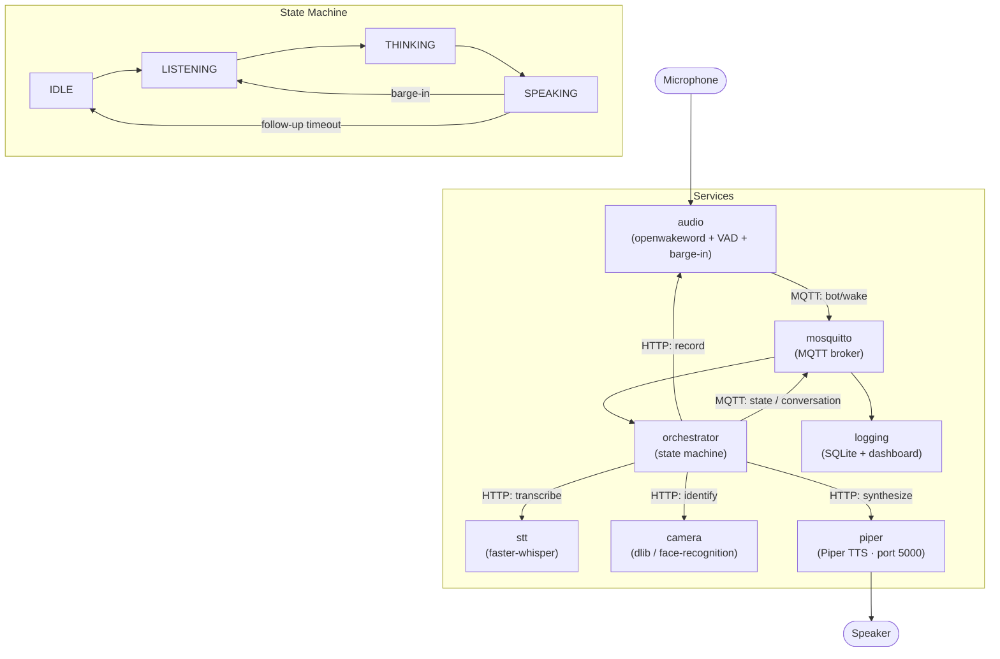

# Voice Bot

An always-listening voice assistant running as Docker microservices on a local machine or Raspberry Pi. It wakes on a keyword, identifies who is in the room via camera, sends the conversation to an LLM with face context injected into the system prompt, and speaks the response via Piper TTS. All inter-service events flow over MQTT, with a live logging dashboard included.

---

## Architecture



---

## Services

| Service | Role |
|---------|------|
| `mosquitto` | MQTT broker — backbone for all inter-service events |
| `audio` | Wake word detection, VAD recording, and barge-in monitoring |
| `stt` | Speech-to-text via faster-whisper |
| `camera` | Per-turn face identification and registration flow |
| `piper` | Piper TTS HTTP server |
| `orchestrator` | Drives the state machine; calls all other services |
| `logging` | Subscribes to MQTT, stores to SQLite, serves dashboard on port 5004 |

---

## State Machine

The orchestrator cycles through four states. **IDLE** waits for a wake word over MQTT. **LISTENING** records audio until VAD detects silence or a timeout is hit. **THINKING** transcribes the audio, identifies faces, streams a response from the LLM via OpenRouter (with face context in the system prompt), and handles optional tool calls. **SPEAKING** plays back TTS audio — a barge-in returns to LISTENING, and a follow-up silence timeout returns to IDLE.

---

## Tool Calling

During THINKING, the LLM may invoke `web_search` (DuckDuckGo) or `get_datetime`. While the tool executes, the bot speaks a filler phrase to fill the silence, then feeds the result back into the conversation. This loop runs up to three iterations before the final response is spoken.

---

## Setup

Copy `.env.example` to `.env` and set your `OPENROUTER_API_KEY`. Then:

```bash
docker compose build   # first build is slow — dlib compiles from source
docker compose up
```

Say **"Alexa"** to wake the bot. The logging dashboard is available at `http://localhost:5004`.

### Prerequisites

- Docker with Buildx
- PulseAudio on the host
- Microphone at `/dev/snd`
- Webcam at `/dev/video0` or `/dev/video1` (optional — face recognition is skipped if absent)
- An [OpenRouter](https://openrouter.ai) API key

---

## Face Registration

When an unknown face is detected the bot asks for the person's name, transcribes the reply, and saves the encoding to a persistent Docker volume. Registered faces are recognised on all subsequent turns and injected into the LLM system prompt as context.

---

## Tests

```bash
pytest
```

Tests live alongside their source in each service's `.py` files and are discovered automatically via `pytest.ini`.

---

## Raspberry Pi

Set `platform: linux/arm64` in `docker-compose.yml` and build directly on the Pi, or run `./build.sh` to cross-compile from x86.
