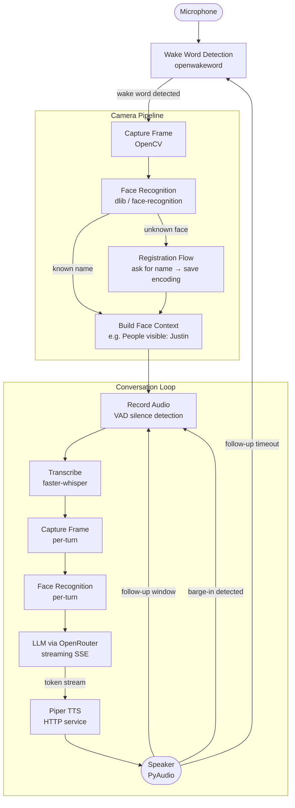

# Voice Bot

An always-listening voice assistant that runs on a local machine or Raspberry Pi via Docker. It wakes on a keyword, transcribes speech locally, identifies who is in the room via camera, sends the conversation to an LLM, and speaks the response back using Piper TTS.

---

## Architecture



---

## Services

| Service | Description |
|---------|-------------|
| `bot` | Main Python process — wake word, STT, LLM, face recognition |
| `piper` | Piper TTS HTTP server — receives text, returns audio |

---

## Prerequisites

- Docker with Buildx (multi-arch support)
- PulseAudio running on the host
- A microphone accessible at `/dev/snd`
- A webcam accessible at `/dev/video0` or `/dev/video1` (optional — face recognition is disabled if no camera is found)
- An [OpenRouter](https://openrouter.ai) API key

---

## Setup

### 1. Clone and configure

```bash
cp .env.example .env
```

Edit `.env` and set at minimum:

```
OPENROUTER_API_KEY=your_key_here
```

### 2. Build

```bash
docker compose build
```

> The first build takes several minutes — dlib compiles from source.

For multi-arch (e.g. building for Raspberry Pi from x86):

```bash
./build.sh
```

### 3. Run

```bash
docker compose up
```

Say **"Alexa"** to wake the bot. It will identify who is visible on camera, then listen for your question.

---

## Configuration

All options are set via `.env`. See `.env.example` for the full list.

| Variable | Default | Description |
|----------|---------|-------------|
| `OPENROUTER_API_KEY` | _(required)_ | OpenRouter API key |
| `OPENROUTER_MODEL` | `openai/gpt-4o-mini` | LLM model to use |
| `WAKE_WORD_MODEL` | `alexa` | openwakeword model name |
| `WHISPER_MODEL` | `tiny` | faster-whisper model size |
| `PIPER_URL` | `http://piper:5000` | URL of the Piper TTS service |
| `SPEECH_TIMEOUT` | `10` | Seconds of silence before giving up recording |
| `FOLLOWUP_TIMEOUT` | `5` | Seconds to wait for a follow-up after the bot speaks |
| `FACE_RECOGNITION_TOLERANCE` | `0.5` | Lower = stricter face matching |
| `CAMERA_INDEX_MAX` | `3` | Number of camera indices to probe |
| `FACES_DIR` | `faces` | Directory to store face images and encodings |
| `SYSTEM_PROMPT` | _(see llm_client.py)_ | Base system prompt sent to the LLM |
| `LOG_LEVEL` | `INFO` | Log verbosity (`DEBUG` for full trace) |

---

## Face Registration

When an unknown face is detected the bot will ask for the person's name, transcribe the answer, and save the encoding to `faces/known_faces.json`. Face images are stored under `faces/images/`. The `faces/` directory is a Docker volume so registrations persist across restarts.

---

## Project Structure

```
.
├── Dockerfile              # Bot container (Python 3.11 slim, multi-arch)
├── entrypoint.sh           # Ensures faces/ dir exists with correct permissions
├── docker-compose.yml      # bot + piper services
├── build.sh                # docker buildx multi-arch build helper
├── requirements.txt        # Python dependencies
├── pytest.ini              # Configures pytest to discover tests in src/*.py
├── .env.example            # All environment variables with defaults
├── faces/                  # Volume — persists face images + known_faces.json
├── piper/
│   ├── Dockerfile          # Piper TTS container
│   └── server.py           # Flask HTTP wrapper around piper binary
└── src/
    ├── main.py             # Entry point — wires all components
    ├── state_machine.py    # VoiceBot state machine (IDLE → LISTENING → PROCESSING → SPEAKING)
    ├── wake_word.py        # Wake word detection via openwakeword
    ├── recorder.py         # Audio recording with VAD and barge-in monitoring
    ├── transcriber.py      # Speech-to-text via faster-whisper
    ├── llm_client.py       # OpenRouter SSE streaming client
    ├── tts_client.py       # Sentence-buffered Piper TTS + PyAudio playback
    ├── camera.py           # OpenCV camera capture
    ├── face_recognizer.py  # Face identification and registration
    └── config.py           # Safe env var helpers
```

---

## Running Tests

```bash
pytest
```

Tests live alongside the code they test in each `src/*.py` file and are discovered via `pytest.ini`.

---

## Raspberry Pi Deployment

Change the platform in `docker-compose.yml`:

```yaml
platform: linux/arm64
```

Then build on the Pi directly or use `./build.sh` to cross-compile from x86.
